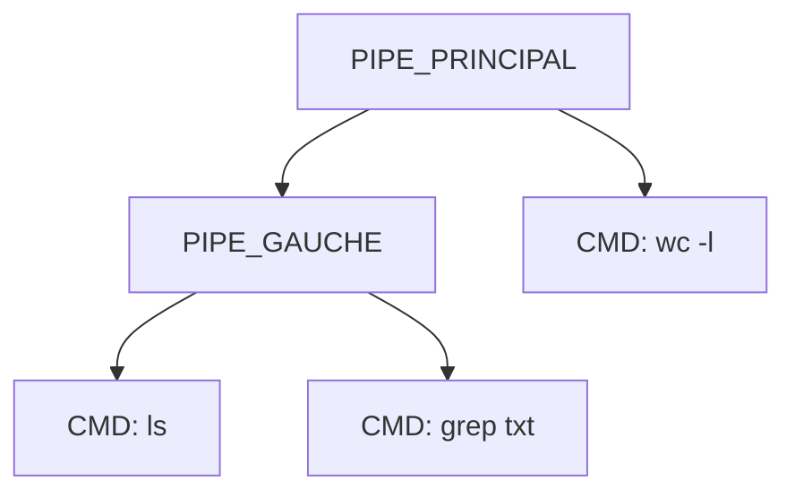

Voici le cheminement complet de la création des pipes
et de l'assignation des file descriptors (FD)
pour la commande `ls | grep txt | wc -l`, structuré en Markdown :

## 🔧 Cheminement complet : Création des pipes et assignation des FD

### 🌳 Structure AST

- **État initial** : Tous les FD sont à `-1` (non assignés)

### 🚀 Premier appel : `handle_pipe(PIPE_PRINCIPAL)`
```c
handle_pipe(PIPE_PRINCIPAL, data, fd, pids)
```

#### 📋 Étape 2.1 : Création du pipe principal
```c
w_pipe(fd, data);  // Crée un nouveau pipe
```
- Résultat : `fd = 4` (lecture), `fd[1] = 5` (écriture)

#### 📋 Étape 2.2 : Configuration côté gauche
```c
assign_pipe_fds(PIPE_GAUCHE, -1, fd[1]);  // fd[1]=5
```
- Transmet le FD d'écriture (5) au sous-pipe

#### 📋 Étape 2.3 : Configuration côté droit
```c
PIPE_PRINCIPAL.right->command.fd_in = fd[0];  // fd[0]=4
```

**État après configuration** :
| Commande   | `fd_in` | `fd_out` |
|------------|---------|----------|
| `ls`       | -1      | -1       |
| `grep txt` | -1      | 5        |
| `wc -l`    | 4       | -1       |

### 🔍 Détail de `assign_pipe_fds(PIPE_GAUCHE, -1, 5)`
```c
assign_pipe_fds(node, fd_in, fd_out) {
    if (node->type == PIPE) {
        assign_pipe_fds(node->pipe.left, -1, -1);   // ls
        assign_pipe_fds(node->pipe.right, -1, 5);   // grep txt
    }
}
```
- Résultat : `grep.txt.fd_out = 5`

### 🔄 Appels récursifs
```c
handle_ast(PIPE_PRINCIPAL.left);  // → handle_pipe(PIPE_GAUCHE)
handle_ast(PIPE_PRINCIPAL.right); // → handle_command(wc -l)
```

### 🚀 Deuxième appel : `handle_pipe(PIPE_GAUCHE)`
```c
handle_pipe(PIPE_GAUCHE, data, fd_nouveau, pids)
```

#### 📋 Étape 5.1 : Création du pipe gauche
```c
w_pipe(fd_nouveau, data);  // Nouveau pipe
```
- Résultat : `fd_nouveau = 6` (lecture), `fd_nouveau[1] = 7` (écriture)

#### 📋 Étape 5.2 : Configuration de `ls`
```c
PIPE_GAUCHE.left->command.fd_out = fd_nouveau[1];  // =7
```

#### 📋 Étape 5.3 : Configuration de `grep txt`
```c
PIPE_GAUCHE.right->command.fd_in = fd_nouveau[0];  // =6
```

**État final** :
| Commande   | `fd_in` | `fd_out` | Signification              |
|------------|---------|----------|----------------------------|
| `ls`       | -1      | 7        | Écrit dans pipe_gauche[1] |
| `grep txt` | 6       | 5        | Lit pipe_gauche, écrit pipe_principal[1] |
| `wc -l`    | 4       | -1       | Lit pipe_principal     |

### 🔗 Flux de données


### 🧩 Rôle d'`assign_pipe_fds`
- **Fonction clé** : Transmet un FD à travers une structure complexe
- **Mécanisme** : Parcourt récursivement l'AST pour assigner :
  - `fd_out` à la commande la plus à droite d'un sous-pipe
  - `fd_in` à la commande la plus à gauche si nécessaire
- **Ne crée pas** de pipes, ne fait que propager les FD existants

### ✅ Points clés
1. **2 pipes créés** :
   - Pipe principal (FD 4-5)
   - Pipe gauche (FD 6-7)
2. **Assignations** :
   - `ls` écrit dans FD 7
   - `grep` lit FD 6 et écrit FD 5
   - `wc` lit FD 4
3. **Fermeture des FD** : Tous les FD inutilisés sont fermés après l'exécution
4. **Hiérarchie** : Les pipes sont créés de droite à gauche (wc → grep → ls)

Ce mécanisme permet une gestion efficace des flux de données entre processus tout en conservant l'isolation entre les différentes étapes du pipeline.

